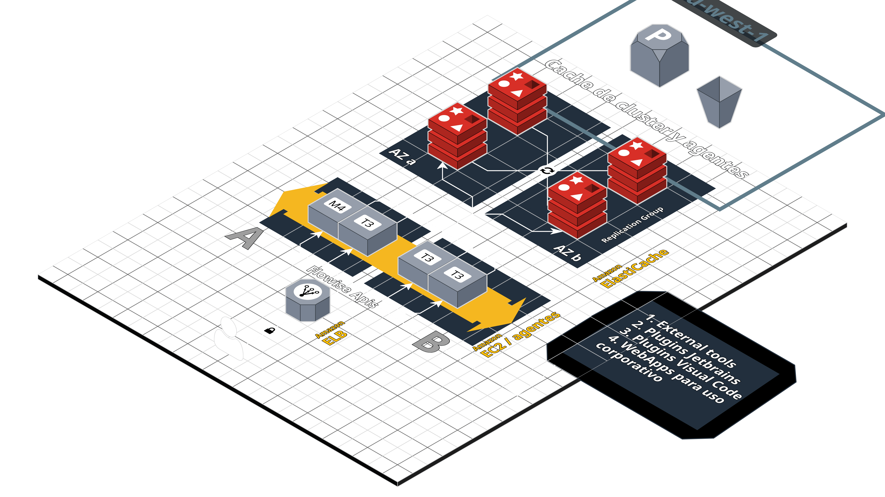

## Índice

0. [Ficha del proyecto](#0-ficha-del-proyecto)
1. [Descripción general del producto](#1-descripción-general-del-producto)
2. [Arquitectura del sistema](#2-arquitectura-del-sistema)
3. [Modelo de datos](#3-modelo-de-datos)
4. [Especificación de la API](#4-especificación-de-la-api)
5. [Historias de usuario](#5-historias-de-usuario)
6. [Tickets de trabajo](#6-tickets-de-trabajo)
7. [Pull requests](#7-pull-requests)

---

## 0. Ficha del proyecto

### **0.1. Tu nombre completo:**
Este proyecto está realizado en equipo por:
- Laura Hernández Ballesta (PM/PO)
    - Encargada de bloques de fase 1
- Osvaldo Ulises Larrea Armenteros (Desarrollador)
    - Encargado de bloques de fase 2 (agente backend)
- Roberto Pérez Sánchez (Desarrollador)
    - Encargado de bloques de fase 2 (agente orquestador)

### **0.2. Nombre del proyecto:**
Orkestify

### **0.3. Descripción breve del proyecto:**
En un entorno donde la eficiencia, trazabilidad y escalabilidad son clave para el crecimiento sostenible, se propone el desarrollo de una **arquitectura multiagente inteligente** que permita automatizar de manera integral el flujo operativo de la empresa, desde la captación de leads hasta el mantenimiento postventa.  
La solución aprovecha tecnologías de automatización, integración de herramientas y arquitectura distribuida, con un **agente orquestador** que coordina múltiples agentes específicos para cada fase del ciclo operativo.

Esta documentación detalla la arquitectura, componentes, flujos y funcionalidades de la solución propuesta, diseñada para transformar digitalmente las operaciones de la empresa y posicionarla como líder en eficiencia y calidad de servicio.

La documentación incluye todos los flujos y bloques desarrollados en Flowise, así como los prompts y configuraciones clave para cada agente IA. Para el proyecto final del master LIDR, se realizarán los siguientes flujos:
- **Fase 1 (Laura):**
    - Generación y actualización incremental de casos de uso.
    - Estimación de esfuerzo y planificación por sprints.
    - Creación automática de tareas en Jira.
- **Fase 2 (Roberto y Osvaldo):**
    - Agente orquestador que recibe tareas desde Jira y las asigna a agentes específicos (frontend o backend). -> Roberto
    - Agente backend que genera código, tests unitarios, PR en GitHub y actualización de estado en Jira. -> Osvaldo

### **0.4. URL del proyecto:**
No disponible públicamente – proyecto en desarrollo.

### **0.5. URL o archivo comprimido del repositorio:**
No disponible públicamente – proyecto en desarrollo.

---

## 1. Descripción general del producto

### **1.1. Objetivo:**
Automatizar todo el ciclo de vida de un proyecto para:
- Aumentar la eficiencia operativa.
- Reducir costes indirectos.
- Mejorar la calidad del servicio entregado.
- Asegurar la documentación y trazabilidad en tiempo real.

### **1.2. Características y funcionalidades principales:**
Funcionalidades definidas en el **MVP**:

- **Comercial (Flujo comercial):**
    - Registro automático de oportunidades en CRM.
    - Generación automática de borradores de propuestas.

- **Project Management y Diseño:**
    - Generación automática de funcionalidades, research y flujo funcional inicial.
    - Generación y actualización incremental de casos de uso.
    - Estimación de esfuerzo y planificación por sprints.
    - Creación automática de tareas en Jira.

- **Desarrollo (Flujo desarrollo principal):**
    - Generación de tareas desde Casos de Uso + Diseño.
    - Testing unitario obligatorio.
    - Integración continua (CI/CD) con GitHub y Jira.
    - Automatización de despliegues.

- **QA (Flujo QA):**
    - Generación de TestCases integrados en X-Ray.

- **Empresa (Flujo empresa):**
    - Automatización de la documentación institucional.
    - Integración fluida con Slack para seguimiento en tiempo real.

### **1.3. Diseño y experiencia de usuario:**
Proyecto en desarrollo.

### **1.4. Instrucciones de instalación:**
La solución se despliega sobre **AWS** con la siguiente infraestructura:
- **Amazon ELB (Elastic Load Balancer):** Balancea carga entre instancias EC2.
- **Amazon EC2 (tipos T3 & M4):** Ejecutan Flowise y agentes IA.
- **Amazon ElastiCache (Redis en Clúster):** Cache distribuida en memoria, garantiza alta disponibilidad.
- **Región AWS us-west-1:** Norte de California.
- **Flowise APIs:** Punto de entrada a los flujos de IA definidos.
- **Herramientas externas conectadas:** CRM, Jira, Confluence, Google Workspace, Figma, GitHub, Slack.

---

## 2. Arquitectura del Sistema

### **2.1. Diagrama de arquitectura**

### **2.2. Descripción de componentes principales**
El sistema se apoya en una arquitectura distribuida y escalable en AWS:

- **Amazon ELB (Elastic Load Balancer):**  
  Balancea la carga entre múltiples instancias EC2 que ejecutan Flowise y los agentes.  
  Beneficio: Escalabilidad y tolerancia a fallos.

- **Amazon EC2 (Agentes y APIs Flowise):**  
  Instancias T3 & M4 que ejecutan:
    - Los flujos diseñados en Flowise.
    - Los agentes IA que orquestan tareas.
    - Respuestas a peticiones API externas.

- **Amazon ElastiCache (Redis en Clúster):**
    - Distribuido en varias zonas de disponibilidad.
    - Cache de datos críticos, respuestas previas, tokens o sesiones.
    - Mejora de rendimiento al reducir llamadas redundantes.

- **Zonas de disponibilidad (AZ-a y AZ-b):**  
  Garantizan alta disponibilidad de la caché y de los servicios.

- **Región AWS us-west-1:**  
  Ubicación: Norte de California.  
  Justificación: cumplimiento normativo y baja latencia.

- **Flowise APIs:**
    - Punto central de entrada a los flujos IA.
    - Permite integraciones vía HTTP (plugins, webs, IDEs como VSCode o JetBrains).

- **Herramientas externas integradas:**
    - CRM, Jira, Confluence, Google Workspace.
    - Figma (UI/UX).
    - GitHub y CI/CD.
    - Slack (notificaciones y consultas).

### **2.3. Descripción de alto nivel del proyecto y estructura de ficheros**
No aplica para el MVP – proyecto basado en flujos de Flowise.

### **2.4. Infraestructura y despliegue**
- **Infraestructura base:** AWS (EC2 + Redis + ELB).
- **Despliegue:**
    - Balanceo de carga con ELB.
    - Autoescalado según demanda.
    - Uso de Redis como caché distribuida para sesiones y tokens.
- **Costes estimados:** ~700€/mes con carga completa.

### **2.5. Seguridad**
- Uso de **scopes mínimos en OAuth2** para integraciones.
- **No almacenar datos personales** más allá de lo necesario.
- Acceso a logs restringido al equipo autorizado.
- Escalado modular por fases sin comprometer seguridad.

### **2.6. Tests**
### 2.6. Tests

#### Test Plan General de Validación de Orkestify

**Objetivo del plan de pruebas:**  
Validar que la herramienta Orkestify cumple con los requisitos definidos en los diferentes flujos (Comercial, Empresa, QA, Fase 1 y Fase 2), asegurando trazabilidad, automatización correcta y calidad del servicio.

---

#### 1. Alcance
- Verificar la correcta automatización de los flujos operativos (captación, documentación, QA, desarrollo).
- Validar la integración con herramientas externas (Productive, Google Calendar, Confluence, Jira, Google Drive, Slack, GitHub, Figma).
- Confirmar la seguridad en el manejo de datos y autenticaciones.
- Asegurar la escalabilidad mediante pruebas básicas de carga en los agentes.

---

#### 2. Tipos de pruebas
- **Pruebas funcionales:** Validar que cada flujo se ejecuta de extremo a extremo.
- **Pruebas de integración:** Confirmar comunicación correcta con APIs externas.
- **Pruebas de seguridad:** Validar autenticación OAuth2 y permisos mínimos.
- **Pruebas de rendimiento:** Medir tiempos de respuesta en consultas y generación de entregables.
- **Pruebas de regresión:** Ejecutar cada vez que se actualice un flujo en Flowise.

---

#### 3. Casos de prueba principales

| ID | Escenario | Entrada | Resultado esperado |
|----|-----------|---------|---------------------|
| TC-FUNC-01 | Creación de deal en Productive | Datos completos de un lead | Deal creado en Productive o email fallback enviado |
| TC-FUNC-02 | Reserva de cita en Google Calendar | Datos de lead + disponibilidad | Evento creado en Google Calendar con confirmación |
| TC-FUNC-03 | Generación de propuesta | Notas de reunión + requisitos | Documento con propuesta estructurada y estimación |
| TC-FUNC-04 | Generación de contrato | Datos de propuesta validada | Contrato disponible en carpeta de Google Drive |
| TC-FUNC-05 | Consulta de documentación interna | Pregunta en Slack | Respuesta con fragmento + enlace a documento |
| TC-FUNC-06 | Generación de test cases | Caso de uso en Confluence + diseño en Figma | Tabla de test cases generada y exportada a Jira/Sheets |
| TC-FUNC-07 | Creación automática de tareas en Jira | Backlog validado en Google Sheets | Issues creados en Jira con campos correctos |
| TC-SEC-01 | Acceso a APIs externas | Token OAuth2 válido | Acceso concedido con permisos mínimos |
| TC-SEC-02 | Acceso a APIs externas | Token inválido | Acceso denegado con mensaje de error |
| TC-PERF-01 | Consulta en Slack (doc interno) | Pregunta estándar | Respuesta en <3 segundos |
| TC-PERF-02 | Generación de flujo funcional inicial | Requisitos de cliente | Documento generado en <30 segundos |
| TC-REG-01 | Modificación de flujo en Flowise | Cambio en nodo Productive API | Flujo sigue funcionando sin afectar nodos previos |

---

#### 4. Herramientas y entorno de pruebas
- **Entorno de staging** en AWS (EC2, Redis, ELB).
- **Herramientas:** Jira XRay, Google Sheets, Slack, Postman (para validar APIs), Flowise (para testear nodos).
- **Datos de prueba:** Leads ficticios, documentos de Confluence de ejemplo, diseños en Figma preparados para QA.

---

#### 5. Criterios de aceptación
- Al menos el **80% de los test cases funcionales** deben ser superados sin incidencias.
- **Tiempo medio de respuesta < 10 segundos** en interacciones críticas (chatbot, Slack, consultas docs).
- **Cobertura mínima del 80%** en test cases automáticos generados desde CU.
- Ningún error crítico de seguridad o autenticación.
- Logs completos y accesibles para auditoría.

---

#### 6. Definition of Done (para QA global)
- Todos los flujos (Comercial, Empresa, QA, Fase 1 y Fase 2) ejecutados sin fallos.
- Integraciones externas verificadas con datos de prueba.
- Logs de ejecución revisados y almacenados.
- Validación firmada por QA y PM en Jira XRay.

---

## 3. Modelo de Datos

### **3.1. Diagrama del modelo de datos:**

El diagrama del modelo de datos se puede encontrar en el siguiente enlace:
- [Diagrama del modelo de datos](https://dbdocs.io/devel/orkestify)
- Password: orkestify

### **3.2. Descripción de entidades principales:**

A continuación se describen las tablas principales del modelo de datos, indicando su propósito y campos clave:

---

#### 🔑 Autenticación y seguridad

- **apikey**  
  Almacena las claves de acceso a la API. Incluye el `apiKey`, `apiSecret` y un nombre descriptivo (`keyName`).  
  Relacionada con un `workspaceId` para delimitar el ámbito.

- **credential**  
  Gestiona credenciales cifradas de acceso a servicios externos. Contiene el nombre visible y los datos encriptados.

- **login_activity**  
  Registra intentos de inicio de sesión, incluyendo mensaje, código de actividad y modo de login.  
  Útil para auditoría y seguridad.

- **login_method**  
  Define métodos de autenticación permitidos para la organización (ej. SSO, password).  
  Contiene configuración, estado y metadatos de creación/actualización.

- **login_sessions**  
  Mantiene sesiones activas de login (`session_id`, `expires`, `data`).

- **user**  
  Representa a los usuarios del sistema con nombre, email, estado, credenciales asociadas y trazabilidad de creación/actualización.

---

#### 👥 Organización y roles

- **organization**  
  Entidad que agrupa usuarios y workspaces. Contiene nombre, customerId, subscriptionId.  
  Asociada a un creador y actualizador (`user`).

- **role**  
  Define roles dentro de una organización, con nombre, permisos y descripción.

- **organization_user**  
  Relación entre usuarios, organizaciones y roles. Incluye estado (activo/invitado) y fechas de creación/actualización.

- **workspace**  
  Espacio de trabajo dentro de una organización. Contiene nombre, descripción y referencia a su organización.

- **workspace_user**  
  Relación entre usuarios y workspaces. Indica el rol dentro del workspace, estado e historial de login.

- **workspace_shared**  
  Registra elementos compartidos dentro de un workspace (documentos, flujos, etc.).

- **variable**  
  Define variables de configuración a nivel de workspace, incluyendo nombre, valor y tipo.

---

#### 🤖 Asistentes y flujos

- **assistant**  
  Almacena asistentes creados en Flowise. Incluye credenciales, detalles, icono y tipo.

- **chat_flow**  
  Representa un flujo de conversación/configuración en Flowise. Incluye nombre, `flowData`, estado de despliegue, configuración de API y analítica.

- **chat_message**  
  Mensajes generados en un chatflow. Contiene rol (usuario/sistema), contenido, documentos fuente, herramientas usadas, anotaciones, reasoning del agente y metadatos de sesión.

- **chat_message_feedback**  
  Feedback de mensajes concretos (ej. rating positivo/negativo). Vinculado a `chatId` y `messageId`.

- **lead**  
  Registra leads captados a través de chatflows (nombre, email, teléfono) y su relación con el `chatflowid`.

- **upsert_history**  
  Histórico de actualizaciones (`upserts`) realizadas en un chatflow, guardando resultado y datos de flujo.

- **upsertions_records**  
  Registra operaciones de inserción/actualización en namespace y claves específicas.

---

#### 📚 Datos, documentos y entrenamientos

- **custom_template**  
  Plantillas de flujo personalizadas con nombre, datos del flujo, descripción y metadatos.

- **dataset**  
  Agrupa colecciones de datos para entrenamiento o pruebas. Contiene nombre y descripción.

- **dataset_row**  
  Filas individuales dentro de un dataset. Contienen input, output y orden de secuencia.

- **document_store**  
  Repositorio de documentos para búsqueda o embeddings. Incluye configuración de vector store y embeddings.

- **document_store_file_chunk**  
  Fragmentos de documentos almacenados en `document_store`. Permite dividir en chunks con metadatos.

---

#### 🧪 Evaluaciones y ejecución

- **evaluation**  
  Registro de evaluaciones de un chatflow frente a un dataset. Contiene métricas, configuración y tipo de evaluación.

- **evaluation_run**  
  Ejecuciones individuales de una evaluación. Guarda input, output esperado, output real, métricas y errores.

- **evaluator**  
  Define evaluadores configurables con nombre, tipo y parámetros.

- **execution**  
  Registra ejecuciones de flujos/agentes. Contiene datos completos de la ejecución, estado, acción y fechas de creación/actualización.

---

#### 🛠️ Utilidades y soporte

- **tool**  
  Tabla de herramientas disponibles para agentes (nombre, descripción, icono, función, esquema).

- **migrations**  
  Control de migraciones de base de datos (id, timestamp, nombre).

---

### Resumen de relaciones principales
- La mayoría de tablas tienen referencia a **workspaceId**, lo que segmenta la información por espacio de trabajo.
- **Usuarios** se relacionan con **organizaciones**, **roles** y **workspaces** mediante tablas de unión (`organization_user`, `workspace_user`).
- **Chatflows** y **asistentes** se asocian a un workspace y pueden generar mensajes, leads y evaluaciones.
- **Datasets**, **documentos** y **evaluaciones** se relacionan para soportar entrenamiento y validación de modelos.

---

## 4. Especificación de la API

No aplica - proyecto basado en flujos de Flowise.

---

## 5. Historias de Usuario

### **Historia de Usuario – Flujo Comercial**
- Como **cliente potencial**, quiero contactar a través de un chatbot web, para poder agendar una cita y compartir mis datos de proyecto de forma sencilla.
- Como **comercial**, quiero recibir automáticamente un deal creado en Productive con datos enriquecidos de la empresa, para evitar tareas manuales y disponer de research útil.
- Como **comercial**, quiero que se genere un borrador de propuesta a partir de los requisitos recogidos en la reunión, para reducir el tiempo de respuesta al cliente.
- Como **comercial**, quiero que el sistema me entregue una estimación de esfuerzo (horas, roles, plazos, coste), para validar con el cliente antes de enviar la propuesta final.
- Como **comercial**, quiero recibir un borrador de contrato en Google Drive con los datos del cliente, para revisarlo y enviarlo de forma ágil.
- Como **equipo**, quiero que todas las fases (deal, propuesta, contrato) queden notificadas en Slack o email, para tener trazabilidad y control del pipeline.

---

### **Historia de Usuario – Flujo Empresa**
- Como **empleado**, quiero consultar documentación interna en Slack mediante un chatbot, para resolver mis dudas rápidamente sin depender de otra persona.
- Como **empleado**, quiero recibir la respuesta del chatbot con enlace directo al documento en Confluence o Google Drive, para acceder a la fuente original.
- Como **responsable departamental**, quiero poder actualizar o añadir documentación en Confluence/Drive, para mantener la información al día.
- Como **responsable departamental**, quiero que el chatbot o sistema detecte información obsoleta y sugiera actualizaciones, para reducir errores y duplicidades.
- Como **equipo**, queremos que toda la documentación esté versionada y accesible, para asegurar consistencia en la organización.

---

### **Historia de Usuario – Flujo QA**
- Como **QA Tester**, quiero generar automáticamente test cases a partir de casos de uso en Confluence y diseños en Figma, para ahorrar tiempo y asegurar cobertura.
- Como **QA Tester**, quiero que los test incluyan identificador, pasos, datos de prueba y resultado esperado, para poder validarlos fácilmente.
- Como **QA Tester**, quiero que los test se sincronicen con Jira XRay, para integrarlos en nuestro proceso de QA.
- Como **QA Tester**, quiero recibir una notificación cuando los test estén listos, para revisarlos y aprobarlos.
- Como **PM**, quiero asegurar trazabilidad entre casos de uso, test cases y resultados, para garantizar calidad en el desarrollo.

---

### **Historia de Usuario – Fase 1: Generación automática de funcionalidades, research y flujo funcional inicial**
- Como **PM/PO**, quiero introducir los requisitos iniciales de un cliente, para que el sistema los interprete y genere funcionalidades de forma automática.
- Como **PM/PO**, quiero obtener un research contextual con referencias y apps similares, para enriquecer la propuesta inicial de proyecto.
- Como **diseñador UX**, quiero recibir un borrador de flujo funcional y pantallas sugeridas, para avanzar más rápido en los prototipos.
- Como **cliente**, quiero que mi input inicial se traduzca en entregables claros (funcionalidades, research, flujos), para validar que el proyecto cubre mis necesidades.

---

### **Historia de Usuario – Fase 1: Generación y actualización incremental de casos de uso**
- Como **PM/PO**, quiero generar casos de uso iniciales a partir de funcionalidades y flujos, para tener documentación estructurada desde el inicio.
- Como **PM/PO**, quiero que los casos de uso se actualicen automáticamente tras cada reunión o cambio de diseño, para mantener la documentación viva.
- Como **diseñador UX**, quiero que mis cambios en Figma se reflejen en los casos de uso, para evitar inconsistencias.
- Como **equipo**, queremos que los casos de uso se almacenen en Confluence y se mantengan sincronizados, para facilitar la colaboración.

---

### **Historia de Usuario – Fase 1: Estimación de esfuerzo y planificación por sprints**
- Como **dev senior/tech lead**, quiero que el sistema descomponga los casos de uso en tareas técnicas, para reducir el tiempo de planificación.
- Como **PM/PO**, quiero obtener una estimación en horas por tarea y por sprint, para planificar mejor con el cliente.
- Como **equipo**, queremos disponer de un backlog en Google Sheets con todas las tareas organizadas, para revisar y ajustar fácilmente.

---

### **Historia de Usuario – Fase 1: Creación automática de tareas en Jira**
- Como **PM/PO**, quiero que las tareas del backlog se creen automáticamente en Jira, para evitar errores manuales.
- Como **equipo de desarrollo**, queremos que cada issue en Jira esté vinculado a su caso de uso original, para asegurar trazabilidad.
- Como **equipo**, queremos recibir un log con todas las tareas creadas, para confirmar que la integración se ejecutó correctamente.

---

### **Historia de Usuario – Fase 2: Flujo de desarrollo autónomo**
- Como **agente IA Orkestify**, quiero recibir tareas “IA-autónomas” desde Jira, para desarrollarlas de forma automática (frontend o backend).
- Como **agente IA**, quiero generar el código siguiendo los diseños de Figma y casos de uso, para integrarlo en el repositorio sin intervención humana.
- Como **agente IA**, quiero generar tests unitarios o de integración junto con el código, para validar calidad antes del PR.
- Como **agente IA**, quiero ejecutar los tests en CI/CD y corregir errores si es posible, para asegurar calidad antes de revisión.
- Como **agente IA**, quiero abrir un Pull Request en GitHub y mover la tarea en Jira a “En revisión”, para entregar el trabajo completo al equipo.
- Como **equipo técnico**, queremos recibir notificación en Slack cuando un PR esté listo, para revisarlo y aprobarlo.
- Como **equipo técnico**, queremos revisar los PR generados por IA, para garantizar calidad y seguridad del proyecto.

---
## 6. Tickets de Trabajo

### **Flujo Comercial**

**Ticket 1 – Integración Productive**
- **Título:** Configuración nodo HTTP Request → Productive API
- **Descripción:** Configurar nodo en Flowise para crear automáticamente deals en Productive a partir de datos captados por el chatbot.
- **Tareas:**
    - Configurar autenticación OAuth2 en el nodo.
    - Mapear campos (nombre, empresa, tipo de proyecto, presupuesto, descripción).
    - Añadir fallback: si falla la API, enviar datos mediante nodo Email.
- **Criterios de aceptación:** Deal creado en Productive o email fallback enviado.

**Ticket 2 – Captura de información inicial**
- **Título:** Chatbot con formulario de leads
- **Descripción:** Crear nodo de entrada (Input Form / Chatbot) en Flowise para recoger datos de cliente.
- **Tareas:**
    - Definir campos requeridos (nombre, empresa, tipo de proyecto, presupuesto, descripción breve).
    - Conectar con nodo Google Calendar API para reservar cita.
- **Criterios de aceptación:** Datos almacenados + cita confirmada.

**Ticket 3 – Registro de logs**
- **Título:** Nodo Logger para captación comercial
- **Descripción:** Implementar nodo Logger en Flowise para guardar cada lead y sus pasos (creación deal, propuesta, contrato).
- **Criterios de aceptación:** Cada acción queda registrada con timestamp y estado.

---

### **Flujo Empresa**

**Ticket 4 – Integración Slack + Documentación**
- **Título:** Nodo Slack Input + Confluence/Drive Loader
- **Descripción:** Configurar recepción de consultas en Slack y búsqueda automática en repositorios internos.
- **Criterios de aceptación:** Consultas simples devuelven enlace/documento correcto.

**Ticket 5 – Formato de respuestas**
- **Título:** Nodo Output → Slack
- **Descripción:** Configurar formato de mensajes en Slack con fragmento destacado y enlace directo al documento.
- **Criterios de aceptación:** Respuesta clara y usable en Slack.

**Ticket 6 – Registro de consultas**
- **Título:** Nodo Logger consultas documentación
- **Descripción:** Guardar cada interacción en logs para métricas posteriores.
- **Criterios de aceptación:** Log incluye usuario, consulta, documento referenciado.

---

### **Flujo QA**

**Ticket 7 – Extracción de casos de uso**
- **Título:** Nodo Confluence Loader → Input Selector
- **Descripción:** Configurar nodo para extraer automáticamente el contenido de casos de uso en Confluence.
- **Criterios de aceptación:** Documento cargado con secciones estructuradas.

**Ticket 8 – Generación automática de test cases**
- **Título:** Nodo LLM Prompt → generación de test cases
- **Descripción:** Configurar prompt para transformar documentación en tabla de test cases.
- **Criterios de aceptación:** Test cases generados con ID, descripción, pasos, datos de prueba, resultado esperado.

**Ticket 9 – Exportación a Jira o Google Sheets**
- **Título:** Nodo condicional → API Jira XRay o Google Sheets
- **Descripción:** Configurar integración para guardar test cases en Jira XRay (preferente) o en Google Sheets.
- **Criterios de aceptación:** Test cases disponibles en herramienta seleccionada.

---

### **Fase 1 – Funcionalidades, research y flujo funcional**

**Ticket 10 – Research contextual**
- **Título:** Nodo Web Search + LLM Prompt
- **Descripción:** Configurar búsqueda contextual (apps similares, buenas prácticas) a partir de requisitos.
- **Criterios de aceptación:** Documento con lista de referencias y enlaces.

**Ticket 11 – Extracción de funcionalidades**
- **Título:** Nodo LLM Prompt → funcionalidades
- **Descripción:** Configurar prompt para generar listado de funcionalidades inferidas con prioridad y dependencias.
- **Criterios de aceptación:** Lista exportada a Confluence.

**Ticket 12 – Generación de flujo funcional**
- **Título:** Nodo LLM Prompt → diagrama de flujo
- **Descripción:** Configurar prompt para crear flujo lógico (pantallas, roles).
- **Criterios de aceptación:** Flujo generado en Markdown / Mermaid y exportado a Confluence.

---

### **Fase 1 – Casos de uso**

**Ticket 13 – Generación inicial de CU**
- **Título:** Nodo LLM Prompt → casos de uso iniciales
- **Descripción:** Configurar prompt sobre plantilla GooApps para generar CU a partir de funcionalidades.
- **Criterios de aceptación:** Documento en Confluence con casos estructurados.

**Ticket 14 – Actualización incremental**
- **Título:** Nodo Confluence Loader + LLM Compare
- **Descripción:** Detectar cambios en requisitos/diseño y actualizar casos existentes.
- **Criterios de aceptación:** Casos actualizados o nuevos añadidos con changelog.

**Ticket 15 – Validación manual**
- **Título:** Nodo Output → sugerencia PM
- **Descripción:** Configurar opción de revisión manual antes de publicar cambios.
- **Criterios de aceptación:** PM puede aceptar o rechazar sugerencias.

---

### **Fase 1 – Estimación de esfuerzo y planificación**

**Ticket 16 – Descomposición en tareas**
- **Título:** Nodo LLM Prompt → backlog técnico
- **Descripción:** Generar tareas técnicas desde CU (descripción, horas estimadas).
- **Criterios de aceptación:** Backlog generado en formato tabla.

**Ticket 17 – Exportación a Google Sheets**
- **Título:** Nodo Google Sheets API
- **Descripción:** Crear hoja con backlog completo + pestañas por sprint.
- **Criterios de aceptación:** Documento compartido con equipo en Drive.

**Ticket 18 – Validación acumulada**
- **Título:** Nodo Logger + Output
- **Descripción:** Configurar resumen acumulado por sprint para validación.
- **Criterios de aceptación:** PM recibe informe con totales de horas.

---

### **Fase 1 – Creación de tareas en Jira**

**Ticket 19 – Integración Sheets → Jira**
- **Título:** Nodo Google Sheets Loader + HTTP Jira API
- **Descripción:** Crear issues en Jira a partir del backlog validado en Sheets.
- **Criterios de aceptación:** Issues creados correctamente con datos mapeados.

**Ticket 20 – Confirmación previa**
- **Título:** Nodo Output → preview
- **Descripción:** Mostrar listado de tareas antes de creación en Jira.
- **Criterios de aceptación:** Tareas solo creadas tras confirmación.

**Ticket 21 – Registro de ejecución**
- **Título:** Nodo Logger creación Jira
- **Descripción:** Guardar número de issues creados, fallidos, enlaces a Jira.
- **Criterios de aceptación:** Log disponible en proyecto.

---

### **Fase 2 – Desarrollo autónomo**

**Ticket 22 – Generación automática de código**
- **Título:** Nodo LLM Prompt → código
- **Descripción:** Configurar prompt para que agente IA genere código (frontend o backend) según CU + Figma.
- **Criterios de aceptación:** Código generado en bloque de salida o repositorio conectado.

**Ticket 23 – Generación de Pull Request**
- **Título:** Nodo GitHub API + Slack Output
- **Descripción:** Configurar creación automática de PR en GitHub y notificación al canal de revisión.
- **Criterios de aceptación:** PR creado, Jira actualizado a “En revisión” y Slack notificado.

**Ticket 24 – Ejecución de tests y logs**
- **Título:** Nodo Testing + Logger
- **Descripción:** Generar y ejecutar tests unitarios/integración desde código, guardar resultados en logs.
- **Criterios de aceptación:** Tests ejecutados, resultados visibles, notificación en caso de fallo.

---

## 7. Pull Requests

No aplica de momento – proyecto en desarrollo.

---

## 8. Documentación extra

En el [siguiente PDF](https://drive.google.com/file/d/1yaJ4MDtHGWenlnkESoEw8BaxDeUMK3Zq/view?usp=sharing) se incluye documentación adicional relevante del proyecto - casos de uso, ejemplo de prompts, diagramas de flujo, etc.

